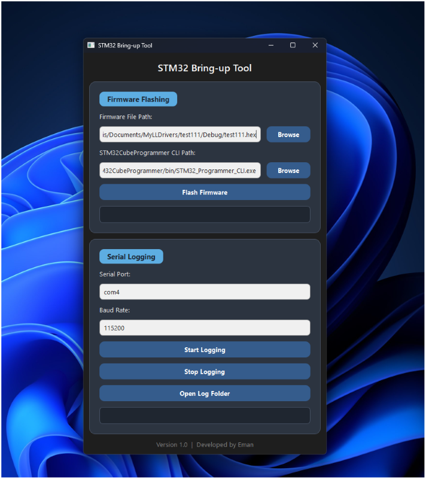
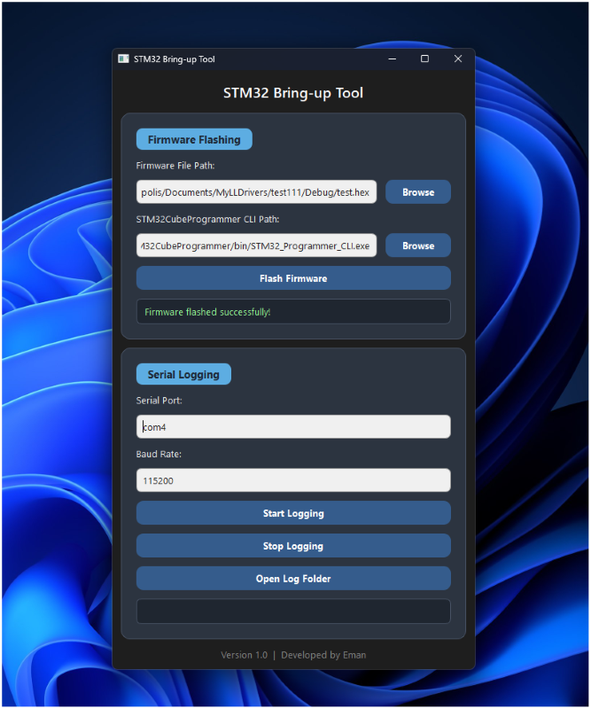
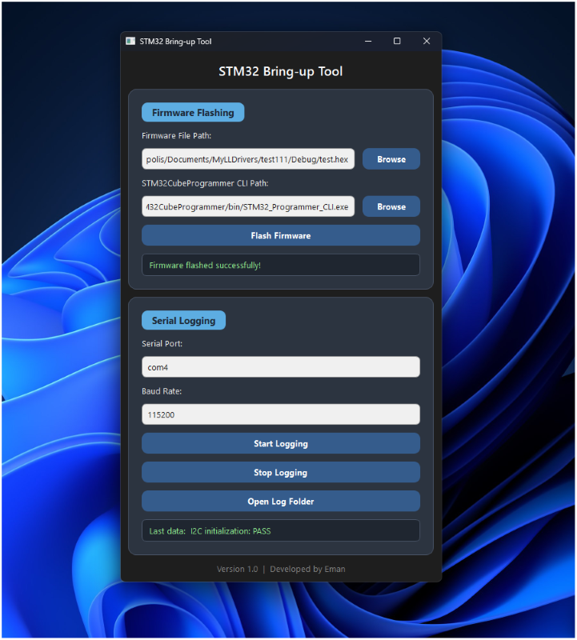

# STM32 Bring-up Tool

A Python-based desktop tool for STM32 board bring-up and validation.

## Features
- Flash STM32 firmware using STM32CubeProgrammer CLI
- Real-time UART/serial logging
- Timestamped log file generation
- GUI built with PySide6
- Saved user settings for firmware path, CLI path, serial port, and baudrate

## Tech Stack
- Python
- PySide6
- pyserial
- STM32CubeProgrammer CLI

## Project Structure
- `main.py` – application entry point
- `gui.py` – GUI logic
- `backend.py` – flashing and serial worker logic

## How to Run
## How to Run
1. Install Python 3.11+  
2. Install dependencies:
   ```bash
   pip install -r requirements.txt
   
3. Run the application:
   ```bash
   python main.py

## Example Output

You can view a sample log generated by the tool:

 [View logging example](examples/sample-log.txt)


## Screenshots

### Main Interface


### Firmware Flashing


### Serial Logging

